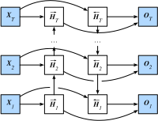

# Bidirectional Recurrent Neural Networks

All the recurrent neural network models so far discussed have assumed that the current time step is determined by the series of earlier time steps. Therefore, they all pass information through hidden states in a forward direction. Sometimes, however, the current time step can be determined by later time steps. For example, when we write a statement, we may modify the words at the beginning of the statement based on the words at the end. Bidirectional recurrent neural networks add a hidden layer that passes information in a backward direction to more flexibly process such information. Figure 6.12 demonstrates the architecture of a bidirectional recurrent neural network with a single hidden layer.

Now, we will look at the specifics of such a network.
For a given time step $t$, the mini-batch input is $\boldsymbol{X}_t \in \mathbb{R}^{n \times d}$ (number of examples: $n$, number of inputs: $d$) and the hidden layer activation function is $\phi$. In the bidirectional architecture:
We assume the forward hidden state for this time step is $\overrightarrow{\boldsymbol{H}}_t  \in \mathbb{R}^{n \times h}$ (number of forward hidden units: $h$)
and the backward hidden state is $\overleftarrow{\boldsymbol{H}}_t  \in \mathbb{R}^{n \times h}$ (number of backward hidden units: $h$). Thus, we can compute the forward and backward hidden states:

$$
\begin{aligned}
\overrightarrow{\boldsymbol{H}}_t &= \phi(\boldsymbol{X}_t \boldsymbol{W}_{xh}^{(f)} + \overrightarrow{\boldsymbol{H}}_{t-1} \boldsymbol{W}_{hh}^{(f)}  + \boldsymbol{b}_h^{(f)}),\\
\overleftarrow{\boldsymbol{H}}_t &= \phi(\boldsymbol{X}_t \boldsymbol{W}_{xh}^{(b)} + \overleftarrow{\boldsymbol{H}}_{t+1} \boldsymbol{W}_{hh}^{(b)}  + \boldsymbol{b}_h^{(b)}),
\end{aligned}
$$

Here, the weight parameters $\boldsymbol{W}_{xh}^{(f)} \in \mathbb{R}^{d \times h}, \boldsymbol{W}_{hh}^{(f)} \in \mathbb{R}^{h \times h}, \boldsymbol{W}_{xh}^{(b)} \in \mathbb{R}^{d \times h}, and \boldsymbol{W}_{hh}^{(b)} \in \mathbb{R}^{h \times h}$ and bias parameters $\boldsymbol{b}_h^{(f)} \in \mathbb{R}^{1 \times h} and \boldsymbol{b}_h^{(b)} \in \mathbb{R}^{1 \times h}$ are all model parameters.

Then we concatenate the forward and backward hidden states $\overrightarrow{\boldsymbol{H}}_t$ and $\overleftarrow{\boldsymbol{H}}_t$ to obtain the hidden state $\boldsymbol{H}_t \in \mathbb{R}^{n \times 2h}$ and input it to the output layer. The output layer computes the output $\boldsymbol{O}_t \in \mathbb{R}^{n \times q}$ (number of outputs: $q$):

$$\boldsymbol{O}_t = \boldsymbol{H}_t \boldsymbol{W}_{hq} + \boldsymbol{b}_q,$$

Here, the weight parameter $\boldsymbol{W}_{hq} \in \mathbb{R}^{2h \times q}$ and bias parameter $\boldsymbol{b}_q \in \mathbb{R}^{1 \times q}$ are the model parameters of the output layer. The two directions can have different numbers of hidden units.

## Summary

* In bidirectional recurrent neural networks, the hidden state for each time step is simultaneously determined by the subseries before and after this time step (including the input for the current time step).

## Problems

* If the different directions use a different number of hidden units, how will the shape of $\boldsymbol{H}_t$ change?
* Referring to figures 6.11 and 6.12, design a bidirectional recurrent neural network with multiple hidden layers.

## Scan the QR Code to [Discuss](https://discuss.mxnet.io/t/2370)

